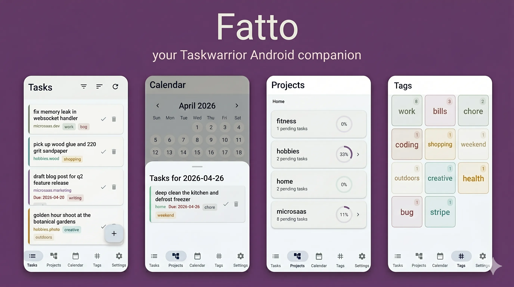

<b>Disclaimer</b>

About 80% of this project was vibecoded. I never wrote anything in klotin in my life and I have a very basic understanding of Rust.

I just wanted a TaskWarrior client for Android, it started as a weekend experiment and accidentally grew into a functional application. I'm releasing it into the wild because the community has been seeking of an opens source syncing TaskWarrior 3.x client for Android for far too long.

It works nice for me and I hope it'll work for you too (but it could be buggy and ruin your tasks, so backup your data before using it - but I said it could, not that it will for sure :D ).

## What is this?

Fatto (italian for "*done*") is a handy TaskWarrior client for Android. It syncs with any standard `taskchampion-sync-server`, filters your tasks, manages your projects, and respects your privacy.

## Features

- **sync**: bi-directional sync with any [`taskchampion-sync-server`](https://github.com/GothenburgBitFactory/taskchampion-sync-server)
- **task**: comprehensive task management with filtering, sorting, and detail editing
- **projects**: hierarchical project management with pending task counts
- **tags**: auto-resizing tag list with pending task counts
- **calendar**: intuitive date pickers for due/scheduled dates
- **notifications**: daily summaries of due/scheduled tasks
- **auto-suggestions**: smart suggestions for projects and tags during task creation

see [roadmap](./ROADMAP.md) for the plan for future features and improvements.

## Installation

I'm working on getting it on fdroid, but in the meantime you can grab the latest `beta` apk from the releases page.

## Architecture

The backend is built in Rust using the official [taskChampion](https://github.com/GothenburgBitFactory/taskchampion), which provides a robust and efficient way to manage tasks and sync with `taskchampion-sync` servers. The frontend is written in Kotlin using Jetpack Compose.

## Contributing

If you want to poke around the internals or build it yourself, the entire development environment is done via nix devshells.
You can build the debug apk with: `just build-debug`. The `justfile` handles the heavy lifting, including cross-compiling the Rust JNI libraries and orchestrating the Kotlin build.
